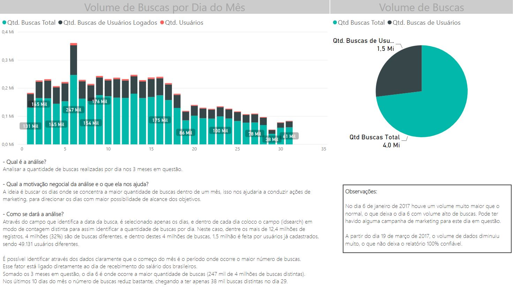

# Análises
---

### Análise 1: Volume de Buscas

1) Qual é a análise?

Analisar a quantidade de buscas realizadas por dia nos 3 meses em questão.

2) Qual a motivação negocial da análise e o que ela nos ajuda?

A ideia é buscar os dias onde se concentra a maior quantidade de buscas dentro de um mês, isso nos ajudaria a conduzir ações de marketing, para direcionar os dias com maior possibilidade de alcance dos objetivos.

3) Como se dará a análise?

Através do campo que identifica a data da busca, é selecionado apenas os dias, e dentro de cada dia coloco o campo (idsearch) em modo de contagem distinta para assim identificar a quantidade de buscas por dia. Neste caso, dentre os mais de 12,4 milhões de registros, 4 milhões (32%) são de buscas diferentes, e dentro destes 4 milhões de buscas, 1,5 milhão é feita por usuários já cadastrados, sendo 49.131 usuários diferentes.

>*É possível identificar através dos dados claramente que o começo do mês é o período onde ocorre o maior número de buscas.*

>*Esse fator pode estar ligado ao dia de recebimento do salário dos brasileiros.*

>*Somado os 3 meses em questão, o dia 6 é onde ocorre a maior quantidade de buscas (247 mil de 4 milhões de buscas distintas).*

>*Nos últimos 10 dias do mês o número de buscas reduz bastante, chegando a ter apenas 38 mil buscas distintas no dia 29.*

*Observações:*

>*No dia 6 de janeiro de 2017 houve um volume muito maior que o normal, o que deixa o dia 6 com volume alto de buscas.*

>*A partir do dia 19 de março de 2017, o volume de dados diminuiu muito.*

### Análise 2: Melhor Preço

1) Qual é a análise?

Mostrar as companhias que a MaxMilhas consegue apresentar os melhores resultados conforme a necessidade dos usuários (Melhor Preço).

2) Qual a motivação negocial da análise e o que ela nos ajuda?

Através dessa análise a equipe consegue trabalhar o approach de cada companhia, identificar deficiências nos preços e buscar oportunidades de melhorias.

3) Como se dará a análise?

A análise se baseia nos campos qtyBetterPriceInAirline e qtyBetterPriceInMM para avaliar a quantidade de buscas que a MaxMilhas consegue apresentar preços melhores do que a própria companhia aérea.

>*Como resultado é possível ver que as duas melhores companhias são GOL (81,4%) e TAM (64,9%) que dentre as buscas que os usuários fizeram, a MaxMilhas conseguiu apresentar um grande percentual de resultados com melhores preços.*

>*Já a companhia aérea AZUL, a MaxMilhas consegue apresentar poucas opções com melhores preços. Em geral a AZUL consegue melhores preços que a MaxMilhas. Desta forma há uma oportunidade a ser trabalhada e consequentemente melhorada.*

### Análise 3: Top 5 Users

1) Qual é a análise?

Avaliar o comportamento dos 5 usuários que mais realizam buscas no MaxMilhas.

2) Qual a motivação negocial da análise e o que ela nos ajuda?

Através da análise comportamental daqueles que são os usuários mais frequentes podemos encontrar padrões e oportunidades de melhorias. Esses usuários são ótimos para avaliação técnica dos sistemas MaxMilhas.

3) Como se dará a análise?

Após realizar a contagem de cada idusers, foi filtrado os 5 maiores em quantidade, o usuário 146187 é o que tem o maior número de buscas no MaxMilhas, chegando a 1.749 buscas.

>Com o filtro dos Top 5, podemos conferir  que o volume de buscas apenas por Ida é bem maior do que voos de Ida/Volta.

---
# Storytelling Análise 1

---
# Análise 2

---
# Análise 3

